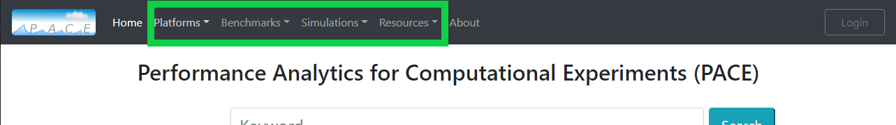

Getting-Started-Portal
=====

To navigate to the portal go to `Performance Analytics for Computational Experiments (PACE). <https://pace.ornl.gov/>`_
10 most recent experiments are displayed in the home screen. To view more recent experiments, click on More Exps button at bottom of the list.

.. image:: pictures/homeScreen.png

There is a high level navigation menu based on sepcific platforms, benchmarks, simulations on top of the page. Navigating through this will
load up the 10 most recent experiments on that respective area and to view more click on the More Exps button at bottom of the list. 

User can also serach for any specific experiments using the search functionality. This is a free form search with auto complete. 
The experiments can be sorted by available option in both ascending and descending order.
Advanced search capability is also available. For example looking for specific user and machine combination, we can do:

.. code-block:: console

    user:gaurab machine:summit

More than one search can also be performed at a time by using pipe (|) for search queries. For example looking for experiments by 2 different users, we can do:

.. code-block:: console

    user:gaurab | user:sarat

If you are looking for a exact match prepend '$' keyword to your search query.
More details about advanced search can be found `here <https://pace.ornl.gov/searchTips/>`_ .

Another capability available is a summary scatter plot. Click on the 'Scatter Plot' button on top right. This will display a scatter graph.
The summary can be displayed for Machine, User, Compset and Res. To view for specific experiments, click on labels on top of graph which will hide/show that data point.
Use labels to filter further down to your interest.

Single Experiment
-------------------

To view the specific experiment, click anywhere on the experiment row.
This will open up the detail profile page for that experiment.

More details on Single experiments

.. toctree::

    single-experiment

Multiple Experiment
--------------------

To compare multiple experiments, Check box for your desire experiments and following graph options will light up green. 
This will allow for multiple experiments to be viewed simultaneously in their respective graphs.

More details on Multiple experiments

.. toctree::

    multiple-experiment