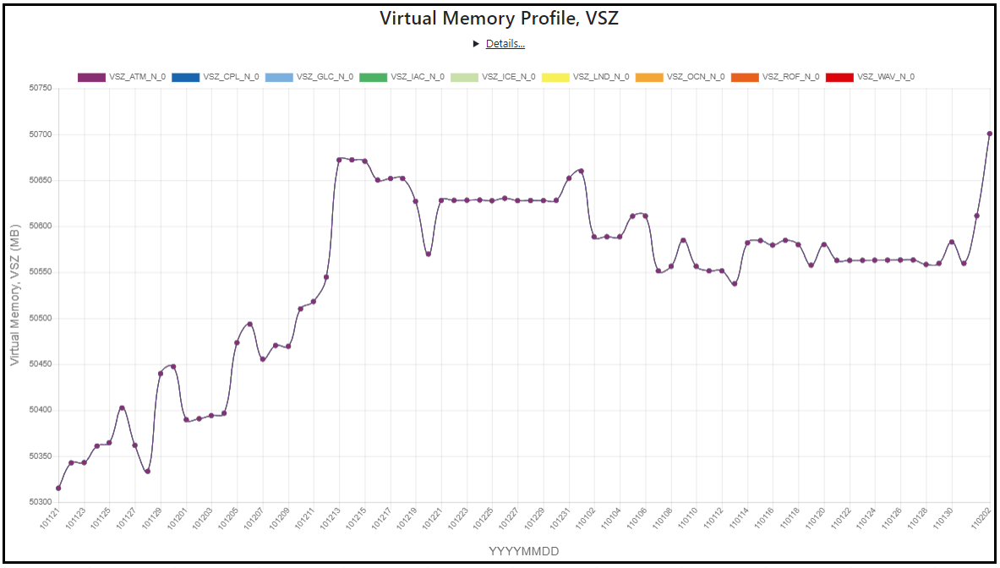

Memory Usage Profile
----------------

A recent version of E3SM master includes an improvement in our memory usage profiling. This page shows how to use it to check for possible 
memory leaks and out-of-memory type of issues.

Memory usage is captured at a node-level for each of 9 ROOTPE component nodes (CPL, ATM, LND, ICE, OCN, GLC, ROF, WAV, IAC) once-a-day
Memory usage is represented by a pair of "highwater" and "usage" numbers. The highwater number represents a total memory footprint of
a process including data paged out to disk (virtual memory) and the usage number represents memory actually residing in RAM (resident set size).
Per-task memory snapshots are summed up across all tasks on a node to derive on-node memory highwater and memory usage in megabytes.

Both Resident and Virtual memory profiling graph is displayed. Click on labels to filter the PE component for your desire view.

Resident Memory Profile (RSS) graph

Virtual Memory Profile (VSZ) graph

