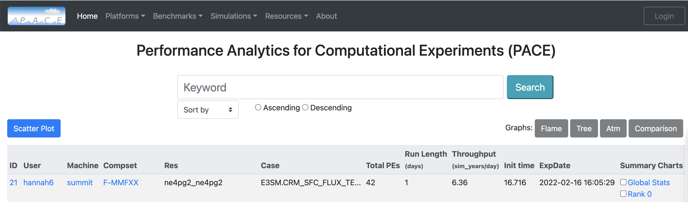

Compare Multiple Experiments
=======

After checking the box for your desired experiments.
Available graphs are flame, tree and atmosphere component.
Available graphs buttons will light up green.

Flame graph
------------

looking at how time is distributed on various application ridges. Flame graph helps to view the row of various processes time distribution.
The time process can be navigeted further deeper by clicking on the process time bar in flame graph.

Tree graph
------------

Tree graph shows the time distributed for each componenent of process time as a bar chart.

Atmosphere componenet graph
----------------

This graph shows the time distribution of the atmosphere component process time distribution. Following process time are displayed in the graph

+---------+------------+
| Label   | Timer(s)   |
+=========+============+
| Convention   | 'a:moist_convection'   |
+--------------+------------------------+
| CLUBB  | 'a:macrop_tend'  |
+--------+------------------+
| Aerosol  | 'a:microp_aero_run' + 'a:tphysbc_aerosols' |
+----------+--------------------------------------------+

    

