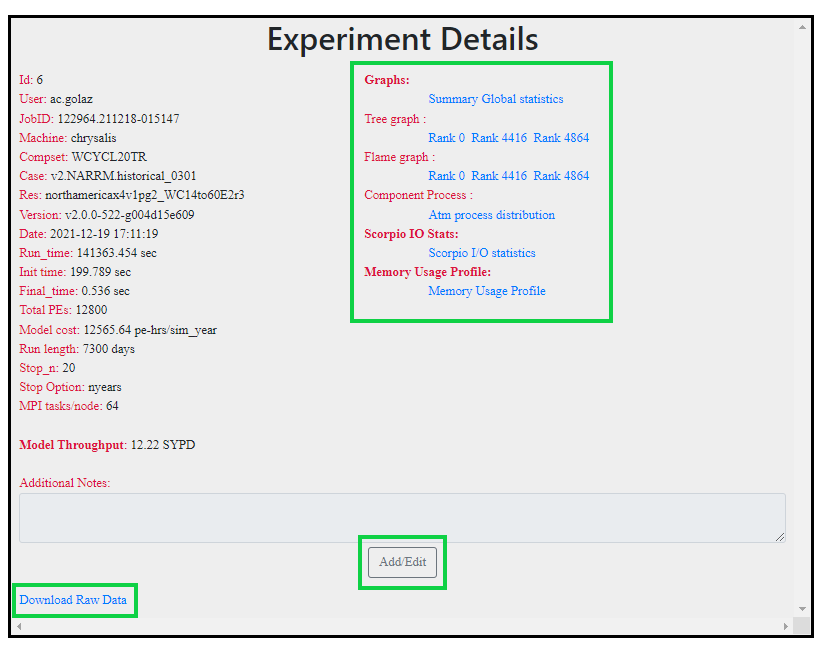
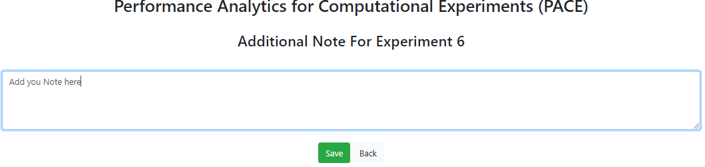
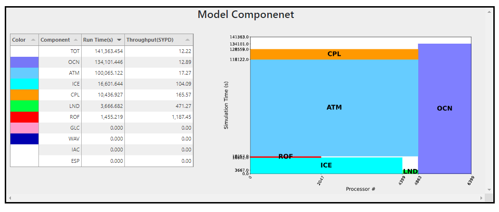
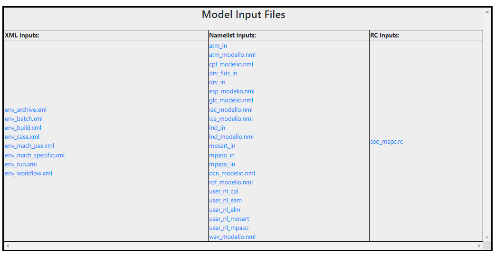

Experiment details
---------------------

The experiment details page displays all the metadata of the experiment.
In Left section, it displays all the available graph of option for the current experiments.
To download experiment click on Download Raw Data.

To add notes to this experiment, click on Add/Edit button which will open up a new tab where you can add notes and save it.

More details on graphs

.. toctree::

    summary-graph
    tree-graph
    flame-graph
    component-graph
    scorpioio-stats-graph
    memory-profile-graph

Model Component
--------------------

In Model Component section, it displays the runtime table and PE layout of the model components.

Model Input Files
---------------------

In this sections, all the model input files are stored and can be viewed in detail by clicking on it. Following Input file are 
available XML Inputs, Namelist Inputs, and RC Inputs.

